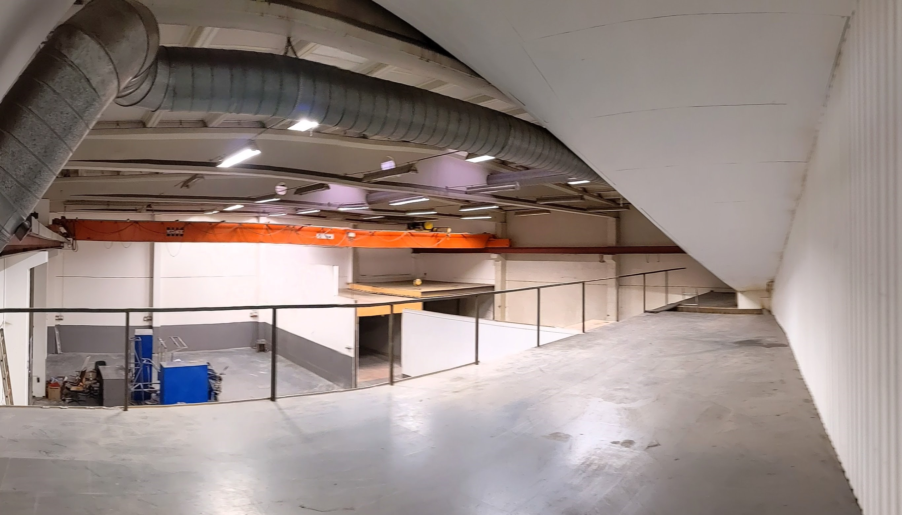
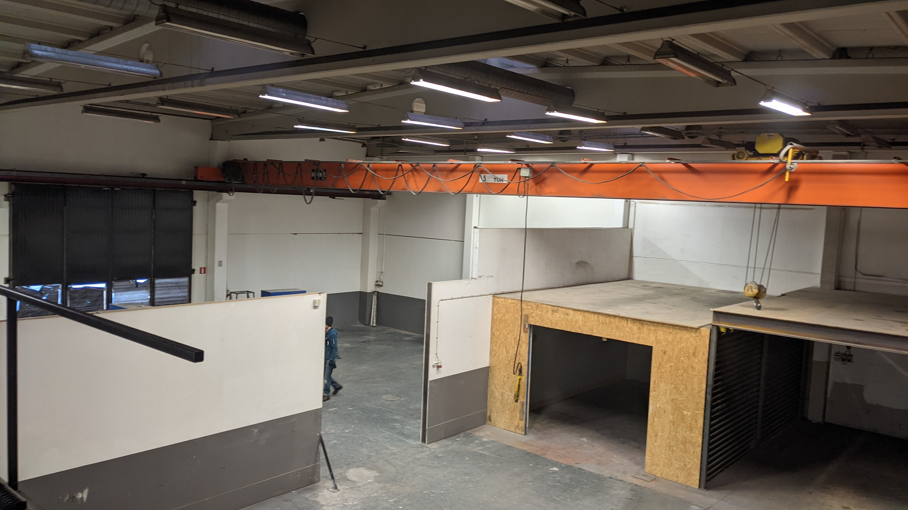
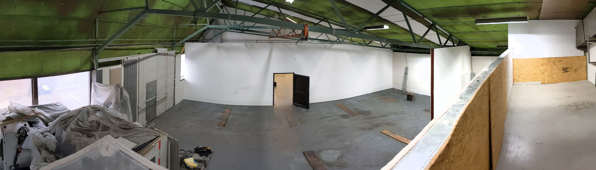
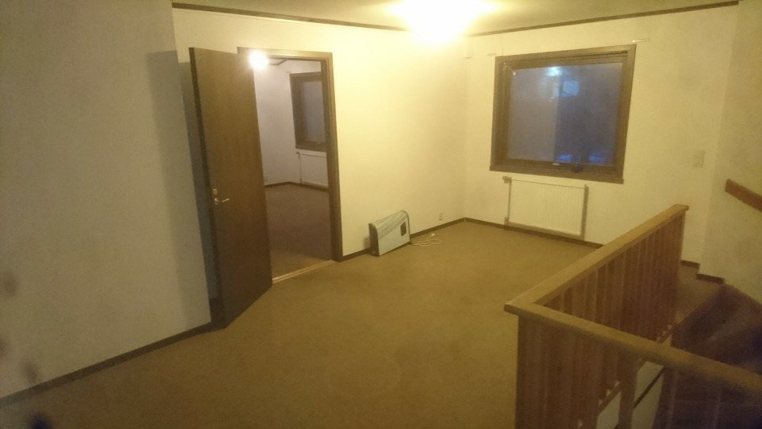
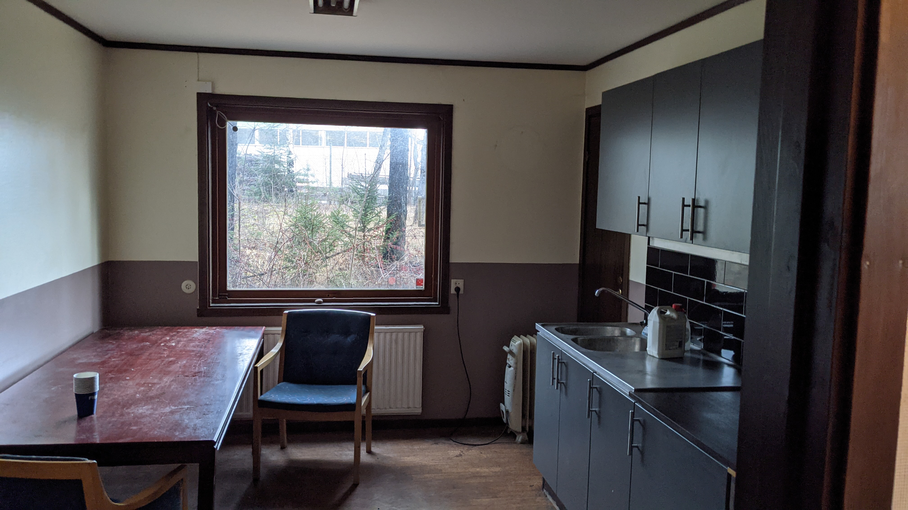
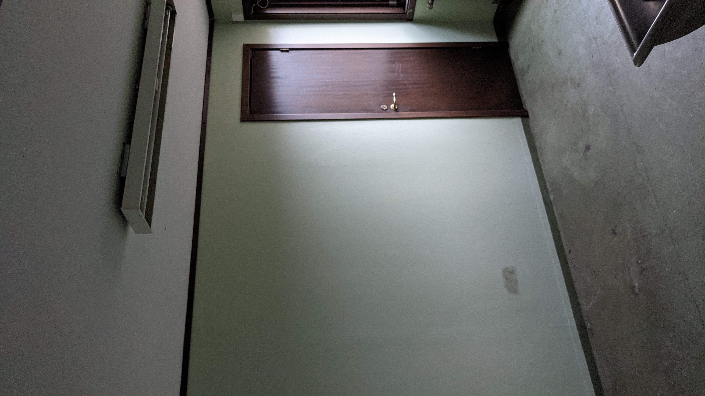

## Råssa 1:14 en fastighet att bygga på

### Info
[Råssa 1:14](https://minkarta.lantmateriet.se/?e=357708.8333333333&n=6395075&z=14&background=2&boundaries=true) ligger i Bollebygds kommun 1 km från påfart till Riksväg 40.

Fastigheten består av en verkstadslokal med yta på 650 m2 samt tillhörande kontor på 50 m2 samt ett kallförråd på 300 m2.

Det finns en asfalterad plan framför verkstaden samt hårdgjord yta för t.ex. uppställning av fordon och maskiner total 5'000 m2

### Verkstadslokalen - nya delen
Nya delen är en lokal på 380 m2 i markplan med en minsta takhöjd på 6m och en fullhöjdsport på 4,5m.
I lokalen finns två områden med kraftigt byggda entresolplan samt travers som behöver besiktigas.

Foto av nya delen från entresol:

[Klicka för att se panoramavy av nya lokalen](images/nya_delen_markhojd.jpg)

[Klicka för en vandring genom lokalen](images/lokalen.mp4)
### Verkstadslokalen - nya delen
Gamla delen är en lokal på 270 m2 i markplan med en takhöjd på 5m och en fullhöjdsport på 4,5m.
I lokalen finns ett kraftigt byggt entresolplan.
I anslutning finns lunchrum/omklädningsrum samt kontor 

Vy på gamla delen från entresol:

[Klicka för att se panoramavy av gamla lokalen](images/gamla_lokalen_markhojd.jpg)

[Klicka för en vandring genom lokalen](images/lokalen.mp4)

### Utsidan

Vy från infarten:

(fler bilder kommer när utflyttningen slutförts på ytan för uppställning av fordon/maskiner)

### Kontor
Ingång till kontoret:

### Lunchrum

### Omklädning
Omklädningsrum med dusch och plats för skåp

### Kallförråd - Boa
Ett 300m2 kallförråd med el.
(bilder kommer när lokalen tömts)

### Kontakt
Välkommen att kontakta oss på W-Mek Värmeteknik\
[Johan Wranker](mailto:wmek@wranker.org) 0708-613124\
[Stefan Munthe](mailto:stefan.munthe@gmail.com) 0739-103731
